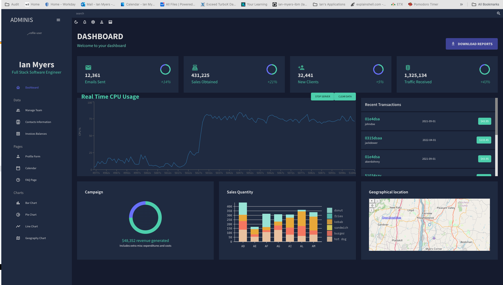

# Dashboard Real-Time CPU Usage React

This project is a real-time dashboard built with React that includes various components:

1. **Mock Data Frontend:** The frontend initially uses mock data to showcase the overall structure of the dashboard.

2. **Live CPU Usage Line Chart:** The line chart component dynamically displays real-time CPU usage data. The chart updates at regular intervals to provide an accurate representation of CPU performance.

3. **Geographical Location Component:** This feature, when implemented, allows users to visualize geographical data. Please note that the specific details of this component may vary based on your location.

4. **Custom Gradient Icon/Table:**
   - Clicking on the gradient icon reveals a custom table feature built with MUI.
   - This table allows you to seamlessly create, edit, copy, and delete rows of data.

## Getting Started with Create React App

This project was bootstrapped with [Create React App](https://github.com/facebook/create-react-app).

### Available Scripts

In the project directory, you can run:

#### `npm start`

Runs the app in the development mode.\
Open [http://localhost:3005](http://localhost:3005) to view it in your browser.
server.js runs a socket for the cpu data PORT=3002
