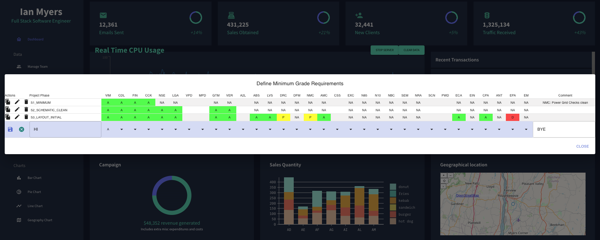

# Dashboard Real-Time CPU Usage React

[https://ian86myers.github.io/dashboard-realtime-cpu-usage-react/](https://ian86myers.github.io/dashboard-realtime-cpu-usage-react/)

This project is a real-time dashboard built with React and includes various components such as fullcalendar/interaction, fullcalendar/react, nivo/line, testing-library/jest-dom, testing-library/react, testing-library/user-event, react-chartjs-2, react-dom, react-ga, react-google-maps, react-pro-sidebar, and recharts.

1. **Mock Data Frontend:** The frontend initially uses mock data to showcase the overall structure of the dashboard.

2. **Live CPU Usage Line Chart:** The line chart component dynamically displays real-time CPU usage data. The chart updates at regular intervals to provide an accurate representation of CPU performance.

3. **Geographical Location Component:** This feature, when implemented, allows users to visualize geographical data. Please note that the specific details of this component may vary based on your location.

4. **Custom Gradient Icon/Table:**
   - Clicking on the gradient icon reveals a custom table feature built with MUI. ( 5th icon to the right under the search )
   - The React component presented is designed to manage an project phase table for defining minimum grade requirements in a UI. It (can) operate with a dynamic list of tests, allowing users to associate specific grades with each test for various project phases. The component facilitates actions such as adding, editing, and deleting project phases, offering a comprehensive interface for handling and updating grade requirements in a flexible and dynamic manner.
   

5. **SpaceX Launch Success Pie Chart:**
   - Visualizes the distribution of SpaceX launch outcomes, showcasing the proportion of successful launches versus failures.
   - Utilizes real-time data from the SpaceX API to provide an up-to-date overview.
   - Responsive design and dynamic styling for a user-friendly experience.
   - Inner radius adjusts based on context, making it adaptable for different dashboard configurations.

## Getting Started with Create React App

This project was bootstrapped with [Create React App](https://github.com/facebook/create-react-app).

### Available Scripts

In the project directory, you can run:

#### `npm start`

Runs the app in the development mode.\
Open [http://localhost:3005](http://localhost:3005) to view it in your browser.
server.js runs a socket for the cpu data PORT=3002
